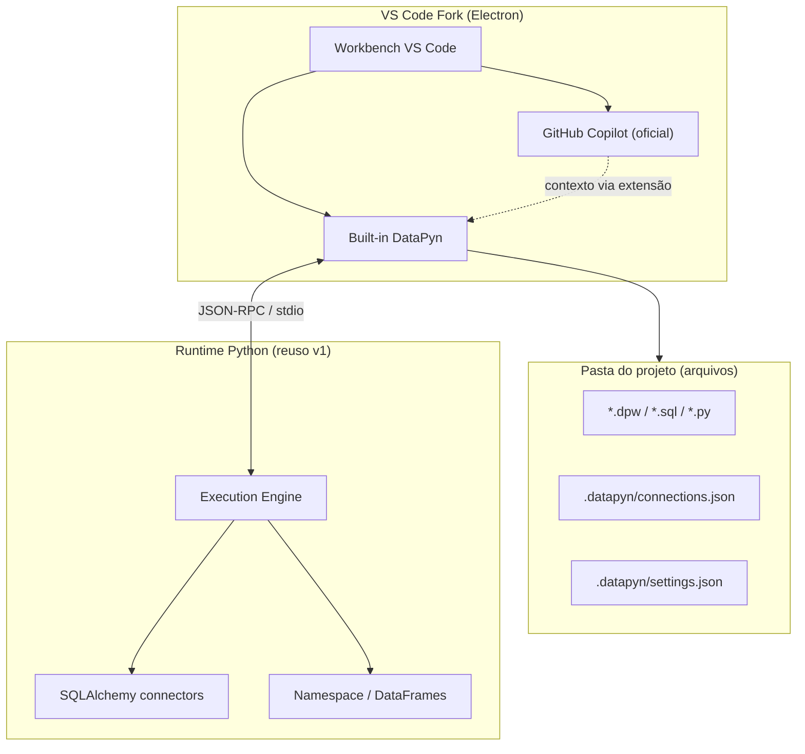

# DataPyn v2 — Plano de migração

> **Status:** proposta de estudo (branch `cursor/datapyn-v2-migration-plan-ce57`)  
> **Objetivo:** manter todas as funcionalidades principais do DataPyn v1, migrar o shell para um **fork do VS Code** (Copilot nativo) e adotar um modelo **baseado em arquivos** no projeto do usuário.  
> **Implementação v2:** monorepo em [`nac/datapyn/v2/`](../nac/datapyn/v2/README.md)

---

## 0. Decisões fechadas (produto)

| # | Decisão | Resolução |
|---|---------|-----------|
| 1 | Formato de análise multi-bloco | **Manter `.dpw`** — mesmo formato JSON do v1; não criar `.dpyn` como substituto |
| 2 | Granularidade do arquivo | **Um arquivo `.dpw` pode conter blocos SQL, Python ou os dois**, como hoje (lista `blocks` com `language` por bloco) |
| 3 | Repositório | **Monorepo** — v2 em `nac/datapyn/v2/`; **produto = `vscode/` (fork)**; `extension/` = built-in; v1 em `source/` |
| 4 | Entrega UI | **Fork VS Code (app DataPyn)** — não extensão instalável no VS Code stock |

Arquivos `.sql` e `.py` continuam como **um bloco por arquivo** (paridade v1). O fluxo principal de análise mista é **`.dpw`**.

---

## 1. Visão

O DataPyn v1 é uma IDE desktop **PyQt6 + Monaco (WebEngine)** com motor de execução SQL/Python embutido, workspaces em `~/.datapyn/` e integração Copilot customizada (LSP + SDK + MCP).

O **DataPyn v2** propõe:

| Dimensão | v1 (atual) | v2 (alvo) |
|----------|------------|-----------|
| **Shell / UI** | PyQt6, docks, Monaco em QWebEngine | Fork do **VS Code** (Electron) |
| **Editor** | Monaco embutido | Editor nativo do VS Code |
| **Copilot** | Integração própria (`github-copilot-sdk`, LSP bundled, MCP tools) | **GitHub Copilot** via extensão oficial no fork |
| **Projeto do usuário** | JSON central (`sessions.json`, `connections.json`) + abas efêmeras | **Pasta de projeto** versionável (Git-friendly) |
| **Motor de dados** | Python in-process (pandas, SQLAlchemy) | Serviço Python (ou extensão + language server) reutilizando lógica v1 |

A mudança não é “trocar o editor” nem “publicar uma extensão na Marketplace”: é **substituir o shell PyQt6 por um aplicativo fork do VS Code** (nova janela / executável DataPyn), com runtime de análise de dados preservado. O código em `extension/` é **extensão built-in** dentro desse fork — não o produto instalável à parte.

---

## 2. Paridade funcional (obrigatório)

Estas capacidades do v1 devem existir no v2 com comportamento equivalente para o usuário final.

### 2.1 Workspace

| v1 | Caminho / mecanismo |
|----|---------------------|
| Perfis isolados | `WorkspaceService` → pasta (`~/.datapyn/` ou custom) |
| Lista global de workspaces | `QSettings("DataPyn", "Workspaces")` |
| Estado de abas | `sessions.json` (blocos, conexão por aba, notificações) |
| Layout da janela | `QSettings("DataPyn", "MainWindow")` |

**v2:** o “workspace” passa a ser a **pasta raiz aberta no VS Code** (`.datapyn/` ou convenção similar), não um diretório oculto só de config.

### 2.2 Conexões salvas

| v1 | `connections.json` no workspace + `ConnectionManager` + UI de grupos |
|----|------------------------------------------------------------------------|
| Motores | SQL Server, MySQL/MariaDB, PostgreSQL, SQLite, Databricks |
| Auth | Entra, tokens Databricks, senhas (plaintext hoje — ver débito técnico) |

**v2:** `connections.json` (ou `.datapyn/connections.json`) **dentro do projeto**, com migração desde `~/.datapyn/`. Secrets via **VS Code SecretStorage** / keyring.

### 2.3 Python + SQL

| v1 | Blocos por aba (`Session` + `BlockEditor`), fila de execução, SQL por bloco ou por aba |
|----|----------------------------------------------------------------------------------------|
| Workers | `SessionSqlWorker`, `PythonWorker` (`main_window/_workers.py`) |
| Cross-syntax | `df = {{ SELECT ... }}` — documentado; executor em produção **incompleto** no v1 |

**v2:** preservar semântica de execução; formato de arquivo pode unificar blocos (ver §4).

### 2.4 DataFrames em memória (automático)

| v1 | `session.namespace` — não serializado; SQL → DataFrame; Python atualiza namespace |
|----|-----------------------------------------------------------------------------------|
| UI | `VariablesPanel`, `ResultsViewer` |

**v2:** namespace **por “sessão de execução”** (documento ou kernel), in-memory; painéis como **Webview / Tree View** do built-in DataPyn no fork.

---

## 3. Arquitetura alvo (v2)



### 3.1 Componentes (pastas no monorepo)

| Pasta | Papel |
|-------|--------|
| [`nac/datapyn/v2/vscode/`](../nac/datapyn/v2/vscode/README.md) | **Produto:** fork [Code-OSS](https://github.com/microsoft/vscode) → executável/janela DataPyn |
| [`nac/datapyn/v2/extension/`](../nac/datapyn/v2/extension/README.md) | **Built-in** (TypeScript): comandos, views, `.dpw` — symlink em `vscode/checkout/extensions/datapyn` |
| [`nac/datapyn/v2/runtime/`](../nac/datapyn/v2/runtime/README.md) | Python: execução, schema, conexões (extraído do v1) |
| [`nac/datapyn/v2/cli/`](../nac/datapyn/v2/cli/README.md) | `datapyn migrate`, `datapyn run` (headless) |

v1 inalterado em `source/` até EOL (Fase 5).

### 3.2 Fork vs extensão no VS Code da Microsoft

| Abordagem | O que o usuário abre | Status no projeto |
|-----------|----------------------|-------------------|
| **Extensão no VS Code stock** | `code` + instalar plugin | **Não é o v2** (só modo dev opcional) |
| **Fork VS Code (escolhido)** | **DataPyn** — mesma base do VS Code, app próprio | `vscode/scripts/bootstrap.sh` + `product.json` |
| Cursor / outros | App terceiro | Fora do escopo pedido |

**Entrega:** instalador do fork (Windows/Linux), com Copilot oficial e built-in DataPyn. Não depende do usuário instalar extensão manualmente.

---

## 4. Modelo baseado em arquivos

### 4.1 Problema do v1

- Estado vivo em `sessions.json` (todas as abas) — difícil de versionar e compartilhar.
- `.dpw` já existe como export pontual, mas o fluxo principal é “abas + auto-save global”.
- Namespace e resultados **não** persistem (correto para dados grandes, mas confunde quem espera “projeto = estado”).

### 4.2 Convenção proposta (pasta do projeto)

```
meu-projeto/
├── .datapyn/
│   ├── connections.json      # migrado do v1
│   ├── settings.json         # tema, atalhos locais, preferências
│   └── .gitignore            # opcional: ignorar secrets
├── analyses/
│   ├── vendas.sql            # um bloco SQL
│   ├── limpeza.py            # um bloco Python
│   └── pipeline.dpw          # vários blocos SQL/Python no mesmo arquivo
├── data/                     # opcional: CSV/Parquet locais
└── README.md
```

### 4.3 Formatos de documento

| Extensão | Uso | v2 |
|----------|-----|-----|
| **`.dpw`** | **Formato principal** — JSON com `version`, `blocks[]` (cada bloco: `language`, `code`, opcional `connection_name`, etc.) | **Idêntico ao v1** — sem breaking change |
| `.sql` / `.py` | Um bloco por arquivo | Mantido |
| `.ipynb` | Import / conversão para blocos | Paridade v1 (Fase 4) |

**Schema `.dpw` (v1 = v2, referência):**

```json
{
  "version": "1.0",
  "blocks": [
    {
      "language": "sql",
      "code": "SELECT 1",
      "block_name": "Query",
      "connection_name": "prod-sql"
    },
    {
      "language": "python",
      "code": "df.head()"
    }
  ],
  "notification_config": {},
  "result_view_state": {}
}
```

Implementação de referência: `source/src/ui/main_window/_file_io.py` (`_save_tab_as_dpw`, abertura multi-bloco).

### 4.4 O que continua só em memória

- DataFrames e variáveis Python (`namespace`) — igual v1.
- Handles de conexão DB ativos.
- Cache de schema / resultados grandes.

Persistência explícita apenas quando o usuário exporta (Parquet, tabela, etc.) — comportamento atual.

### 4.5 Ferramenta de migração v1 → v2

`datapyn migrate`:

1. Lê `~/.datapyn/` ou workspace custom.
2. Emite `connections.json` → `.datapyn/connections.json`.
3. Converte cada entrada de `sessions.json` em `analyses/<titulo>.dpw` (mesmo JSON de blocos que o v1 já serializa).
4. Gera relatório (abas sem título, cross-syntax incompleto, senhas em plaintext).

---

## 5. Integração Copilot

### 5.1 v1 (a substituir no shell)

| Peça | Localização |
|------|-------------|
| Chat WebView | `copilot_chat_panel.py`, `copilot_chat_app.js` |
| LSP inline | `copilot_lsp_client.py`, `inline_completion_service.py` |
| MCP tools | `mcp_tools.py` (~40 operações na IDE) |
| Auth | `copilot_auth_service.py`, `gh` CLI |

### 5.2 v2

- **Inline + Chat:** extensão **GitHub Copilot** oficial no fork (sem reimplementar LSP).
- **Contexto DataPyn:** extensão registra:
  - `Language Model Tool` / participantes de chat (API VS Code 1.9+).
  - Commands: “explicar query”, “gerar bloco SQL”, “inserir schema no prompt”.
- **MCP:** avaliar **MCP no VS Code** (preview) para portar ferramentas críticas de `mcp_tools.py` (executar bloco, ler schema, listar variáveis) — mapeamento 1:1 com prioridade.

### 5.3 Matriz de porte MCP (prioridade)

| Ferramenta v1 | Prioridade v2 | Notas |
|---------------|---------------|-------|
| `get_context`, `read_schema` | P0 | Contexto para Copilot |
| `execute_block`, `connect_database` | P0 | Loop agente ↔ dados |
| `create_block`, `edit_block` | P1 | Edição assistida |
| `create_tab` | P2 | Tabs viram arquivos abertos |
| Chat history custom | — | Delegar ao Copilot |

---

## 6. Extração do motor (reuso do código v1)

Módulos Python candidatos a **`datapyn-runtime`** (mínima alteração inicial):

| Módulo v1 | Responsabilidade |
|-----------|------------------|
| `source/src/database/` | Conexões, SQLAlchemy, auth |
| `source/src/ui/main_window/_workers.py` | `PythonWorker`, exec SQL |
| `source/src/services/schema_service.py` | Object Explorer |
| `source/src/services/python_execution_service.py` | Namespace, imports |
| `source/src/utils/sql_parameter_service.py` | Parâmetros `@nome` |
| `source/src/services/file_import_service.py` | CSV, ipynb, etc. |

**Não portar para o runtime (ficam no v1 até EOL):** `PyQt6`, `ui/`, `editors/monaco/`, `design_system/`, docking.

**Interface runtime ↔ extensão:** JSON-RPC sobre stdio (padrão LSP) ou gRPC local — comandos: `execute`, `list_variables`, `get_results`, `connect`, `load_schema`.

---

## 7. Fases de migração

### Fase 0 — Fundação (estudo + PoC)

- [ ] Decisão fork vs extensão-only (este documento recomenda fork).
- [x] PoC **runtime** + código **built-in** (`extension/` + `runtime/`) — testável via subprocess; embutido no fork via symlink.
- [ ] **Primeiro build do fork** (`vscode/scripts/bootstrap.sh` + `build.sh` → `checkout/scripts/code.sh`).
- [ ] Validar schema `.dpw` v1.0 no built-in.
- [ ] Spike: SecretStorage para credenciais.
- [x] Scaffold monorepo + scripts fork em `nac/datapyn/v2/vscode/`.

**Entregável Fase 0:** janela **DataPyn** = binário do fork com built-in; não `.vsix` na Marketplace.

### Fase 1 — Runtime desacoplado

- [ ] Extrair `datapyn-runtime` do `source/` v1 com testes pytest existentes (adaptados).
- [ ] API estável de execução (SQL + Python + namespace).
- [ ] Completar **cross-syntax** no runtime (débito v1).

**Entregável:** pacote pip `datapyn-runtime` usável sem GUI.

### Fase 2 — Extensão VS Code (MVP)

- [ ] Abrir pasta = workspace DataPyn.
- [ ] Explorer: conexões, schema, variáveis.
- [ ] Executar `.sql` / `.py` / `.dpw` (Run Block / Run All, fila como v1).
- [ ] Painel de resultados (Webview ou tabela nativa).
- [ ] `datapyn migrate` CLI.

**Entregável:** extensão instalável no Code OSS build local.

### Fase 3 — Fork produto + Copilot

- [ ] `product.json`: nome DataPyn, ícones, extensões bundled.
- [ ] Copilot pré-requisito documentado; fluxo de login `gh`/Microsoft.
- [ ] Portar ferramentas MCP P0/P1.
- [ ] CI: build Windows/Linux (substituir/evoluir MSI PyInstaller).

**Entregável:** instalador DataPyn v2 beta.

### Fase 4 — Paridade avançada v1

- [ ] Import drag-drop, export script, export to table.
- [ ] Notificações agendadas, periodic run.
- [ ] Pacotes Python gerenciados (venv por workspace).
- [ ] Auto-update (GitHub Releases → VS Code update channel).

### Fase 5 — EOL v1

- [ ] Período dual-run (6+ meses recomendado).
- [ ] Documentação “Migrar do DataPyn clássico”.
- [ ] Congelar `main` v1 exceto `fix` críticos; feature só em v2.

---

## 8. Riscos e decisões em aberto

| # | Risco / decisão | Mitigação |
|---|-----------------|-----------|
| R1 | Custo de merge do fork VS Code | Equipe dedicada; tracking upstream semanal; usar extensão para lógica de negócio |
| R2 | Copilot licensing no fork | Seguir termos GitHub; não redistribuir tokens; usar extensão oficial |
| R3 | Performance DataFrame grande no Webview | Limite de linhas no painel; lazy load; PyArrow/Parquet spill opcional |
| R4 | PyQt-specific code em workers | Refatorar sinais Qt → callbacks/async no runtime |
| R5 | Senhas plaintext em `connections.json` | Migrar para SecretStorage na Fase 0/1 |
| R6 | Cross-syntax incompleto no v1 | Fechar no runtime antes do MVP v2 |
| R7 | Usuários Windows MSI | Manter pipeline até v2 estável; installer Electron/Squirrel |

### Decisões ainda em aberto

1. **Suporte a Jupyter nativo** (.ipynb) no v2 ou só conversão para `.dpw`?
2. **Conexão padrão por arquivo `.dpw`:** campo top-level `connection` no JSON ou só por aba/bloco (hoje: aba/sessão + override por bloco)?

---

## 9. Estimativa de esforço (técnico, não calendário)

| Área | Invasividade | Dependências |
|------|--------------|--------------|
| Fork VS Code + CI | Alta | Infra, signing, legal |
| Extensão TypeScript | Média | APIs VS Code, Webview |
| Runtime Python | Média-baixa | Reuso direto v1 |
| Modelo arquivos + migrate | Média | Schema, testes golden |
| Copilot/MCP | Média | APIs em evolução no VS Code |
| Paridade UI (results, OE) | Alta | Muitas telas PyQt a reimplementar |

---

## 10. Próximos passos imediatos

1. **Review** deste plano com stakeholders (produto + engenharia).
2. **PoC Fase 0** em `nac/datapyn/v2/`: Code OSS + extensão mínima + `SELECT 1` via runtime.
3. **Issue breakdown** no GitHub: labels `v2`, `parity`, `runtime`, `vscode-fork`.
4. **Fechar cross-syntax** no v1/runtime — reduz surpresa na migração.

---

## Referências no repositório v1

| Tópico | Arquivo |
|--------|---------|
| Entrada da aplicação | `source/main.py` |
| Workspace | `source/src/core/workspace_service.py` |
| Sessões / abas | `source/src/core/session_manager.py`, `session.py` |
| Conexões | `source/src/database/connection_manager.py` |
| Execução Python | `source/src/ui/main_window/_workers.py` |
| Copilot MCP | `source/src/services/copilot/mcp_tools.py` |
| Formato `.dpw` | `source/src/ui/main_window/_file_io.py` |
| Instruções agentes | `AGENTS.md` |

---

*Documento gerado como parte do estudo DataPyn v2. Não implementa código de produção — define direção e fases para implementação futura.*
