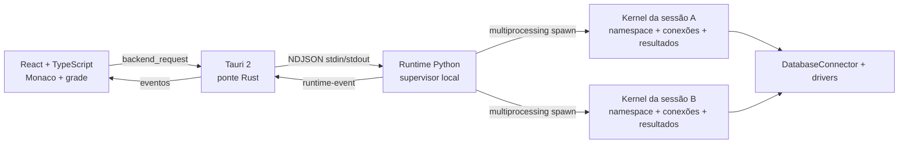

# Migração do DataPyn para Tauri 2

## Objetivo e estágio

Manter o DataPyn como aplicativo desktop instalado, com SQL, Python, arquivos locais, bancos, atalhos e fluxo por blocos, substituindo a apresentação PyQt por React/TypeScript. A primeira entrega é uma fundação executável do fluxo SQL → DataFrame → Python; a migração completa exige a matriz de paridade abaixo.

O legado continua disponível durante a transição. Não há migração automática das pastas do usuário nem substituição da distribuição oficial. O [diagnóstico inicial](DATAPYN_DIAGNOSTIC_AND_MIGRATION_BASELINE.md) registra o ponto de partida; esta página descreve a arquitetura escolhida e o trabalho restante.

## Arquitetura



- **React** cuida de interação, foco, blocos, modelos Monaco e estado visual. DataFrames grandes ficam no Python; a grade pede intervalos de linhas.
- **Rust/Tauri** cuida do ciclo de vida, transporte tipado e integração desktop. O frontend não recebe uma API genérica para executar comandos do sistema. Em desenvolvimento, Rust inicia o interpretador local; em release, inicia o sidecar empacotado.
- **Supervisor Python** recebe comandos e roteia respostas/eventos. Não executa o código do usuário nem consultas longas no loop de controle.
- **Kernel por sessão** conserva namespace, conexões e resultados entre blocos. Uma execução por sessão preserva a ordem SQL/Python e evita disputa sobre o namespace; sessões diferentes podem continuar independentemente.
- **Núcleo legado reaproveitado** mantém drivers, parsing SQL e exportação. Imports necessários ao runtime são independentes de Qt; adaptar a apresentação não deve duplicar regras de negócio.

Separar processos limita o impacto de loops, extensões nativas e processamento pesado sobre a UI. Isso não torna Python arbitrário uma sandbox de segurança: o código continua executando localmente sob o usuário.

## Contrato de transporte

Tauri expõe `backend_request({method, params})`; eventos chegam pelo canal `runtime-event`. Entre Rust e Python, cada linha de stdin/stdout contém um objeto JSON UTF-8:

```json
{"id":1,"method":"session.create","params":{}}
{"id":1,"result":{"session_id":"..."}}
{"id":2,"error":{"code":"...","message":"..."}}
{"event":"execution.finished","payload":{"session_id":"...","execution_id":"...","status":"succeeded","results":[],"variables":[]}}
```

Stdout é exclusivo do protocolo. Logs vão para stderr; stdout do usuário torna-se evento de execução. A UI correlaciona cada execução por `execution_id`, nunca pela sessão atualmente selecionada.

Comandos expostos pela ponte da fundação: `system.info`, `session.create`, `session.close`, `connection.connect`, `schema.get`, `execution.run`, `execution.cancel`, `result.page`, `workspace.read` e `workspace.write`. `system.shutdown` é um comando interno do supervisor, usado no encerramento e nos testes sem interface; a UI não o recebe na whitelist. Outros comandos devem entrar no contrato com validação de parâmetros, erros previsíveis e testes. Execução assíncrona retorna confirmação de fila; resultados chegam por eventos.

Cancelar uma execução travada reinicia o kernel da sessão afetada. O evento `session.reset` informa `namespace_lost: true`: variáveis, resultados em memória e conexões desse kernel precisam ser reconstruídos. Código e estado visual permanecem na interface. A UI deve informar essa perda e impedir uso de handles de resultados anteriores.

O formato de resultados deve preservar NULL, inteiros grandes, decimals e timestamps. Paginação é uma janela sobre o resultado completo, não uma nova consulta SQL por página. Filtro/ordenação/exportação devem operar sobre o conjunto completo quando forem migrados. Arrow IPC é uma evolução possível após medir custo de transferência e tipos; não é requisito para começar.

## Componentes

React/TypeScript oferece uma base única para apresentação e contratos. Monaco conserva edição SQL/Python, seleção, undo e providers; assets e workers são empacotados localmente. A fundação usa Glide Data Grid, MIT, para seleção/copiar e renderização sob demanda. Dockview React é candidato para docking, persistência de layout e painéis flutuantes.

A escolha do shell Tauri mantém Python como sidecar e usa a WebView do sistema. Windows usa WebView2; macOS/Linux usam WebKit, exigindo validação em cada plataforma. O tamanho do shell não determina a memória total do aplicativo: kernels e DataFrames precisam de medições próprias. Fontes: [Tauri sidecars](https://v2.tauri.app/develop/sidecar/), [WebViews](https://v2.tauri.app/reference/webview-versions/), [Monaco](https://github.com/microsoft/monaco-editor), [Glide](https://github.com/glideapps/glide-data-grid).

AG Grid Community não oferece automaticamente toda a paridade desejada: seleção por intervalo, clipboard e XLSX embutido são Enterprise. Dockview mantém docking/floating/popouts no pacote MIT, mas alguns recursos novos são comerciais. Não adicionar dependência comercial por acidente. Popouts Dockview exigem URL HTTP(S) de mesma origem e precisam de adaptação/teste no protocolo Tauri. Fontes: [AG Grid clipboard](https://www.ag-grid.com/react-data-grid/clipboard/), [seleção](https://www.ag-grid.com/react-data-grid/cell-selection/), [XLSX](https://www.ag-grid.com/react-data-grid/excel-export/), [Dockview licença](https://dockview.dev/docs/overview/licence/), [popouts](https://dockview.dev/docs/core/groups/popoutGroups/).

## Matriz de paridade

"Fundação" indica o escopo da primeira fatia. "Pendente" significa que a migração ainda não pode se declarar completa. A conclusão de uma linha exige teste de comportamento e comparação com a versão atual, não apenas presença do controle na tela.

| Área | Escopo | Gate de paridade |
|---|---|---|
| Sessões e blocos SQL/Python | Fundação | Ordem, foco, nomes de saídas e namespace por aba |
| Execução, erro e stdout | Fundação | Última expressão, prints, traceback e resultados múltiplos |
| Kernel isolado e cancelar | Fundação | Loop/trava em A não impede B; reset remove handles antigos e encerra subprocessos locais daquele kernel |
| Grade paginada | Fundação | Tipos, NULL, cópia e resultados sem duplicação integral no browser |
| SQLite local | Fundação | Consulta real SQL → Python e conexão por sessão |
| SQL Server/Windows Auth/Entra | Pendente | pyodbc/pymssql, LocalDB, MFA, TLS e cancelamento real |
| PostgreSQL/MySQL/MariaDB/Databricks | Pendente | Contexto/schema, parâmetros, OAuth e resultados reais |
| Conexão por bloco | Pendente | Pool e contexto independente dentro da mesma sessão |
| Parâmetros SQL | Pendente | Compartilhados e por bloco, substituição e persistência |
| Monaco e edição | Fundação/parcial | Seleção/undo/foco, ESM offline e todas as ações existentes |
| Autocomplete/diagnósticos/formatar | Pendente | SQL schema/aliases, namespace Python, Ruff e SQL formatter |
| Atalhos configuráveis | Pendente | Inventário legado completo e prioridade por foco/editor/grade |
| Object Explorer | Pendente | Tabelas, colunas, procedures, schema e navegação |
| Grade completa | Pendente | Filtros por tipo, ordenar, formatar, seleção e resumo |
| Exportações | Pendente | CSV/XLSX/Parquet/script, seleção vs resultado completo |
| Gráficos | Pendente | matplotlib/Plotly, configuração, exportação e reabertura |
| Variáveis e inspeção | Fundação/parcial | Namespaces, previews, editar e ações de contexto |
| Workspaces/salvar/restaurar | Pendente | `.dpw` atual, sessões/blocos/parâmetros e versionamento |
| Importar arquivos/notebooks | Pendente | Drag/drop CSV/JSON/XLSX, scripts e Jupyter existentes |
| Docking/layout | Pendente | Painéis, abas, multi-monitor e save/restore |
| Pynia/ACP/MCP/ghost text | Pendente | Agentes atuais, autenticação, streaming, ferramentas e cancelamento |
| Gerenciador de pacotes | Pendente | Ambiente instalável do kernel sem alterar deps do supervisor |
| Timer/notificações | Pendente | Periodicidade, fila sem sobreposição e templates existentes |
| Tema/idiomas/configurações | Pendente | Claro/escuro, pt-BR/en-US, tamanho de fonte e preferências |
| Single instance/arquivos recentes | Pendente | Abrir arquivos do SO e encaminhar para instância ativa |
| Instalador/update/rollback | Pendente | Máquina limpa, drivers, assinatura, dados e reversão |

## Fases e critérios de saída

1. **Fundação vertical:** Tauri + React, protocolo, kernel por sessão, SQLite → DataFrame → Python, grade e cancelamento. Testes de contrato, isolamento e transporte congelado. A interface continua marcada como migração em andamento.
2. **Edição e dados:** catálogo completo de comandos/atalhos, edição Monaco, conectores por bloco, parâmetros, schemas, grade e exports. Comparar scripts/workspaces reais e tipos de dados com o legado.
3. **Produtividade e estado:** formatos de arquivo, layout, importação, variáveis, gráficos, timers, notificações e preferências. Migrar cópias escolhidas; manter backup e versões de schema.
4. **Pynia e ambientes:** ACP/MCP/ghost text e instalações de pacotes por ambiente. Preservar integrações atuais e suas ações, não apenas o chat.
5. **Distribuição:** build por SO/arquitetura, assinaturas, atualização, máquina sem Python e smoke de drivers/autenticação. Medir startup, memória e cancelamento do bundle real.
6. **Substituição:** matriz sem pendências, comparação E2E, uso com dados reais, migração verificável e caminho de rollback. Só então retirar a UI PyQt da distribuição principal.

## Empacotamento do runtime

`scripts/tauri/runtime_entry.py` chama `multiprocessing.freeze_support()` antes de importar o aplicativo. O PyInstaller usa o mesmo executável para supervisor e filhos `spawn`; ele reconhece os argumentos internos `--multiprocessing-fork`. Esses argumentos não são passados manualmente pelo usuário. Referência: [PyInstaller multiprocessing](https://pyinstaller.org/en/stable/common-issues-and-pitfalls.html#multi-processing).

O primeiro bundle usa **onefile** para casar com `externalBin` sem depender de uma pasta `_internal` externa. A spec inclui drivers e bibliotecas de dados, usa Matplotlib Agg e exclui Qt. Extração/startup e reabertura de kernels precisam ser medidos. Uma variante onedir poderá reduzir alguns custos, mas exigirá empacotar a árvore completa e preservar recursos/links.

PyInstaller não cria um ambiente de pacotes livremente instalável equivalente a CPython + venv. O gerenciador de pacotes será migrado com runtime CPython provisionado e ambientes do kernel separados das dependências estáveis do serviço. O código legado que insere site-packages no processo da UI não será o modelo final.

## Validação e CI

A pipeline `tauri.yml` é independente da release PyQt e roda em paths da migração. A matriz inicial cobre Windows e Linux: valida frontend, runtime, smoke source, Cargo fmt/check/test e build nativo com smoke do sidecar. Artefatos são entregas de CI; não são publicados como release oficial. Instaladores são opcionais no disparo manual. macOS, assinatura e execução dos instaladores em máquina limpa continuam como gates da fase de distribuição.

Métricas de saída: tempo até editar; primeira página da grade; scroll com resultado grande; memória com múltiplas sessões; latência de comandos durante loop/consulta/exportação; cancelamento; shutdown sem processos órfãos; instalação e abertura offline. Registrar hardware, dataset e versões junto de cada comparação. Nenhum ganho numérico de performance é prometido sem medição.

## Primeira entrega na branch de migração

A branch `codex/tauri-migration` inicia a nova interface sem retirar o aplicativo atual. A prévia implementa abas e blocos SQL/Python, edição Monaco com seleção/undo, execução sequencial, stdout/erros, variáveis, imagens Matplotlib, schema básico, grade paginada com ordenação/filtro/cópia, atalhos centrais configuráveis e abertura/salvamento do formato `.dpw` por aba. Campos ainda não utilizados pela prévia são preservados no arquivo; preservação não significa execução desses recursos.

O fluxo SQL → DataFrame nomeado → Python foi validado com SQLite. Os formulários dos seis conectores e os drivers legados estão disponíveis, mas bancos externos e autenticações reais ainda exigem validação. Cancelamento de uma execução ativa reinicia seu kernel, remove seus subprocessos e descarta variáveis, resultados e conexão; outras sessões continuam disponíveis. Cancelar antes do início mantém o namespace. No Windows, cada kernel tem seu próprio Job Object, dentro do grupo supervisionado pelo Tauri.

Validação local em Windows, em 3 de outubro de 2026:

- 188 testes de regressão do legado passaram após extrair os imports necessários sem Qt; QSettings usou arquivos INI temporários.
- 30 testes do frontend passaram, cobrindo atalhos, documentos, estado, eventos anteriores ao ACK, falhas e cancelamento.
- 11 testes do runtime passaram usando subprocessos e o protocolo real, incluindo precisão dos dados, Jobs aninhados, recuperação de falhas e encerramento dos filhos.
- 4 testes Rust passaram, incluindo o transporte real SQL/Python e encerramento com o mutex de entrada ocupado.
- TypeScript/Vite, Cargo fmt/check/test e build Windows sem instalador foram verificados. A janela nativa abriu e identificou o runtime Python. A automação visual não completou o roteiro de interação.
- O smoke do runtime congelado passou sem caminhos do checkout: SQL → DataFrame → Python, segunda sessão durante loop, cancelamento, remoção do subprocesso criado e recuperação. O executável final está em `desktop/src-tauri/target/release/datapyn-desktop.exe`, com `datapyn-runtime.exe` ao lado. Os dois arquivos devem permanecer juntos.

O bundle inicial usa assets locais e um runtime congelado sem Qt. O JavaScript principal ainda gera aviso de tamanho (aproximadamente 3,64 MB, 961 KB gzip); carregamento e memória com análises grandes precisam de medição. Resultados SQL são materializados no kernel antes da paginação, e filtro/ordenação podem percorrer todo o DataFrame. A grade reduz transferência e renderização, mas ainda não limita a memória da consulta.

A próxima fase completa edição e dados: inventário integral de atalhos, parâmetros, conexões por bloco, conectores reais, grade e exportações. Pynia/ACP/MCP, ambientes instaláveis, timers, layout, importações, preferências e distribuição continuam na matriz acima. Linux/macOS, instalação em máquina limpa e substituição da versão oficial ainda não foram validados localmente.
