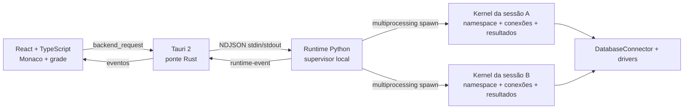

# Migração do DataPyn para Tauri 2

## Objetivo e estágio

Manter o DataPyn como aplicativo desktop instalado, com SQL, Python, arquivos locais, bancos, atalhos e fluxo por blocos, substituindo a apresentação PyQt por React/TypeScript. A primeira entrega é uma fundação executável do fluxo SQL → DataFrame → Python; a migração completa exige a matriz de paridade abaixo.

O legado continua disponível durante a transição. Não há migração automática das pastas do usuário nem substituição da distribuição oficial. O [diagnóstico inicial](DATAPYN_DIAGNOSTIC_AND_MIGRATION_BASELINE.md) registra o ponto de partida; esta página descreve a arquitetura escolhida e o trabalho restante.

## Arquitetura



- **React** cuida de interação, foco, blocos, modelos Monaco e estado visual. DataFrames grandes ficam no Python; a grade pede intervalos de linhas.
- **Rust/Tauri** cuida do ciclo de vida, transporte tipado e integração desktop. O frontend não recebe uma API genérica para executar comandos do sistema. Em desenvolvimento, Rust inicia o interpretador local; em release, inicia o sidecar empacotado.
- **Supervisor Python** recebe comandos e roteia respostas/eventos. Não executa o código do usuário nem consultas longas no loop de controle.
- **Kernel por sessão** conserva namespace, conexões e resultados entre blocos. Uma execução por sessão preserva a ordem SQL/Python e evita disputa sobre o namespace; sessões diferentes podem continuar independentemente.
- **Núcleo legado reaproveitado** mantém drivers, parsing SQL e exportação. Imports necessários ao runtime são independentes de Qt; adaptar a apresentação não deve duplicar regras de negócio.

Separar processos limita o impacto de loops, extensões nativas e processamento pesado sobre a UI. Isso não torna Python arbitrário uma sandbox de segurança: o código continua executando localmente sob o usuário.

## Contrato de transporte

Tauri expõe `backend_request({method, params})`; eventos chegam pelo canal `runtime-event`. Entre Rust e Python, cada linha de stdin/stdout contém um objeto JSON UTF-8:

```json
{"id":1,"method":"session.create","params":{}}
{"id":1,"result":{"session_id":"..."}}
{"id":2,"error":{"code":"...","message":"..."}}
{"event":"execution.finished","payload":{"session_id":"...","execution_id":"...","status":"succeeded","results":[],"variables":[]}}
```

Stdout é exclusivo do protocolo. Logs vão para stderr; stdout do usuário torna-se evento de execução. A UI correlaciona cada execução por `execution_id`, nunca pela sessão atualmente selecionada.

Comandos expostos pela ponte da fundação: `system.info`, `session.create`, `session.close`, `connection.connect`, `schema.get`, `execution.run`, `execution.cancel`, `result.page`, `workspace.read` e `workspace.write`. `system.shutdown` é um comando interno do supervisor, usado no encerramento e nos testes sem interface; a UI não o recebe na whitelist. Outros comandos devem entrar no contrato com validação de parâmetros, erros previsíveis e testes. Execução assíncrona retorna confirmação de fila; resultados chegam por eventos.

Cancelar uma execução travada reinicia o kernel da sessão afetada. O evento `session.reset` informa `namespace_lost: true`: variáveis, resultados em memória e conexões desse kernel precisam ser reconstruídos. Código e estado visual permanecem na interface. A UI deve informar essa perda e impedir uso de handles de resultados anteriores.

O formato de resultados deve preservar NULL, inteiros grandes, decimals e timestamps. Paginação é uma janela sobre o resultado completo, não uma nova consulta SQL por página. Filtro/ordenação/exportação devem operar sobre o conjunto completo quando forem migrados. Arrow IPC é uma evolução possível após medir custo de transferência e tipos; não é requisito para começar.

## Componentes

React/TypeScript oferece uma base única para apresentação e contratos. Monaco conserva edição SQL/Python, seleção, undo e providers; assets e workers são empacotados localmente. A fundação usa Glide Data Grid, MIT, para seleção/copiar e renderização sob demanda. Dockview React foi adotado para oito painéis, arraste, resize, layout persistente, grupos flutuantes e janelas nativas com portais React. O editor monta somente os blocos próximos da viewport; modelo, undo, seleção e cursor sobrevivem à desmontagem do widget.

A escolha do shell Tauri mantém Python como sidecar e usa a WebView do sistema. Windows usa WebView2; macOS/Linux usam WebKit, exigindo validação em cada plataforma. O tamanho do shell não determina a memória total do aplicativo: kernels e DataFrames precisam de medições próprias. Fontes: [Tauri sidecars](https://v2.tauri.app/develop/sidecar/), [WebViews](https://v2.tauri.app/reference/webview-versions/), [Monaco](https://github.com/microsoft/monaco-editor), [Glide](https://github.com/glideapps/glide-data-grid).

AG Grid Community não oferece automaticamente toda a paridade desejada: seleção por intervalo, clipboard e XLSX embutido são Enterprise. Dockview mantém docking/floating/popouts no pacote MIT, mas alguns recursos novos são comerciais. Não adicionar dependência comercial por acidente. Popouts Dockview exigem URL HTTP(S) de mesma origem e precisam de adaptação/teste no protocolo Tauri. Fontes: [AG Grid clipboard](https://www.ag-grid.com/react-data-grid/clipboard/), [seleção](https://www.ag-grid.com/react-data-grid/cell-selection/), [XLSX](https://www.ag-grid.com/react-data-grid/excel-export/), [Dockview licença](https://dockview.dev/docs/overview/licence/), [popouts](https://dockview.dev/docs/core/groups/popoutGroups/).

## Estado da migração

A implementação desta etapa está na branch `codex/tauri-migration`. O inventário detalhado de comportamento, atalhos e evidências está em [TAURI_FEATURE_PARITY.md](TAURI_FEATURE_PARITY.md); ele distingue implementação, teste local e aceite externo. A interface PyQt continua disponível para comparação e retorno.

| Área | Implementação nesta etapa | Validação necessária fora do ambiente local |
|---|---|---|
| Conexões e grupos | CRUD, grupos aninhados, favoritos, busca, ordem, clone, import/export, credenciais keyring, contexto por bloco | Bancos reais, Windows/Entra/OAuth e drivers instalados no cliente |
| Object Explorer | Árvore lazy, cache, atualização com expansão preservada, SELECT/COUNT/DDL, info de entidade, contexto/schema | Catálogos remotos grandes e fidelidade de metadata por driver |
| Edição e execução | Monaco offline, SQL/Jedi, diagnósticos/Ruff, parâmetros, atalhos remapeáveis, foco, seleção, blocos e fila por aba | Aceite diário de teclado/IME e todos os gestos em vários monitores |
| Dados e gráficos | Grade canvas paginada, filtros AND tipados, sort, seleções esparsas exatas, clipboard/formatos, resumo, imports, exports e Plotly/Matplotlib | Datasets reais de maior volume e características específicas dos bancos |
| Estado e arquivos | DPW preservando campos, notebooks/scripts, perfis, layout, recentes, Parquet opt-in automático e restauração | Associações de arquivo e recuperação em máquina limpa |
| Pynia e pacotes | ACP real, quatro agentes, MCP, ghost text, perguntas/permissões, anexos, fontes e ambiente de pacotes isolado | Agentes autenticados, download/instalação reais e fontes privadas |
| Desktop e distribuição | Dockview/popouts Tauri, temas/idiomas/fontes, single instance, notificações, diagnósticos, updater assinado separado | Canal/chaves de release, instalador em máquina limpa e SMTP/Telegram reais |

A consulta direta para CSV/Parquet usa streaming e staging atômico; a grade trabalha sobre handles no kernel. Views ordenadas/filtradas têm cache limitado a quatro entradas/256 MiB e são invalidadas quando o namespace muda. Preview, páginas, clipboard, anexos, gráficos e saídas têm limites explícitos. Bibliotecas grandes (Monaco e variantes Plotly) são assets locais carregados sob demanda.

Antes de fechar ou instalar atualização, o frontend grava os documentos e o layout atual, aguarda a fila de persistência e solicita o flush de snapshots opt-in dos kernels ociosos. A instalação é bloqueada enquanto houver execução, pacote, atividade ACP ou operação de fundo. O canal de atualização desta branch fica indisponível até receber endpoint HTTPS e chave pública explícitos; não usa o atualizador MSI do PyQt.

## Validar esta etapa

Na raiz, com `.venv` provisionado por `uv sync --dev`:

```powershell
npm --prefix desktop ci
npm --prefix desktop test
npm --prefix desktop run build
uv run pytest -c runtime_tests/pytest.ini runtime_tests -q
uv run python scripts/tauri/check_legacy.py
uv run python scripts/tauri/smoke_runtime.py
uv run python scripts/tauri/smoke_parity.py
node scripts/tauri/check.mjs
npm --prefix desktop run desktop:build -- --no-bundle
```

O build desktop recompila o sidecar e executa os dois smokes com estado temporário. O segundo smoke passa pelo catálogo SQLite, SQL → Python, Explorer/autocomplete, parâmetros, resumo/seleções, cinco formatos de exportação, Excel import, gráficos PNG/JPEG/HTML/JSON, rich outputs, snapshot/restart, precisão de Decimal em streaming, drivers importados e uma tabela de um milhão de linhas com paginação e filtro/sort. Ele verifica a ausência de Qt no kernel e emite tempos locais; esses tempos não substituem benchmark em produção. Não instala pacotes nem autentica agentes/serviços externos.

`check_legacy.py` usa as exclusões da suíte CI do PyQt e instala, antes da coleta, QSettings INI em diretório temporário e um keyring em memória. O construtor Qt `QSettings(organization, application)` usa o formato nativo mesmo após `setDefaultFormat`, por isso o runner também adapta esse overload. Nenhuma configuração ou credencial do desktop deve servir como fixture de teste.

## Fases e critérios de saída

1. **Fundação vertical:** Tauri + React, protocolo, kernel por sessão, SQLite → DataFrame → Python, grade e cancelamento. Testes de contrato, isolamento e transporte congelado. A interface continua marcada como migração em andamento.
2. **Edição e dados:** catálogo completo de comandos/atalhos, edição Monaco, conectores por bloco, parâmetros, schemas, grade e exports. Comparar scripts/workspaces reais e tipos de dados com o legado.
3. **Produtividade e estado:** formatos de arquivo, layout, importação, variáveis, gráficos, timers, notificações e preferências. Migrar cópias escolhidas; manter backup e versões de schema.
4. **Pynia e ambientes:** ACP/MCP/ghost text e instalações de pacotes por ambiente. Preservar integrações atuais e suas ações, não apenas o chat.
5. **Distribuição:** build por SO/arquitetura, assinaturas, atualização, máquina sem Python e smoke de drivers/autenticação. Medir startup, memória e cancelamento do bundle real.
6. **Substituição:** matriz sem pendências, comparação E2E, uso com dados reais, migração verificável e caminho de rollback. Só então retirar a UI PyQt da distribuição principal.

## Empacotamento do runtime

`scripts/tauri/runtime_entry.py` chama `multiprocessing.freeze_support()` antes de importar o aplicativo. O PyInstaller usa o mesmo executável para supervisor e filhos `spawn`; ele reconhece os argumentos internos `--multiprocessing-fork`. Esses argumentos não são passados manualmente pelo usuário. Referência: [PyInstaller multiprocessing](https://pyinstaller.org/en/stable/common-issues-and-pitfalls.html#multi-processing).

O primeiro bundle usa **onefile** para casar com `externalBin` sem depender de uma pasta `_internal` externa. A spec inclui drivers e bibliotecas de dados, usa Matplotlib Agg e exclui Qt. Extração/startup e reabertura de kernels precisam ser medidos. Uma variante onedir poderá reduzir alguns custos, mas exigirá empacotar a árvore completa e preservar recursos/links.

PyInstaller não cria um ambiente de pacotes livremente instalável equivalente a CPython + venv. O gerenciador de pacotes será migrado com runtime CPython provisionado e ambientes do kernel separados das dependências estáveis do serviço. O código legado que insere site-packages no processo da UI não será o modelo final.

## Validação e CI

A pipeline `tauri.yml` é independente da release PyQt e roda em paths da migração. A matriz inicial cobre Windows e Linux: valida frontend, runtime, smoke source, Cargo fmt/check/test e build nativo com smoke do sidecar. Artefatos são entregas de CI; não são publicados como release oficial. Instaladores são opcionais no disparo manual. macOS, assinatura e execução dos instaladores em máquina limpa continuam como gates da fase de distribuição.

Métricas de saída: tempo até editar; primeira página da grade; scroll com resultado grande; memória com múltiplas sessões; latência de comandos durante loop/consulta/exportação; cancelamento; shutdown sem processos órfãos; instalação e abertura offline. Registrar hardware, dataset e versões junto de cada comparação. Nenhum ganho numérico de performance é prometido sem medição.

## Validação local da implementação atual

A referência funcional foi confrontada com 114 comportamentos e os atalhos completos; a matriz registra código, testes e aceites ainda abertos. A implementação preserva o PyQt para comparação e retorno, com estado separado da prévia.

Em Windows, em 3 de outubro de 2026, foram verificados:

- 1.700 testes da suíte CI do legado, com QSettings INI temporário e keyring em memória.
- 213 testes do runtime sem Qt, incluindo processos reais, cancelamento, streaming, snapshots, precisão e recuperação do serviço de linguagem.
- 115 testes em 22 arquivos do frontend, incluindo foco/documentos destacados, patch da grade, clipboard, formatos, conexões, editor, documentos e atalhos.
- Cargo fmt/check e seis testes Rust do transporte, encerramento, whitelist, updater e origens dos pop-outs.
- TypeScript/Vite e npm ci com patch versionado da grade; npm audit sem vulnerabilidades na rodada local.
- SQL → DataFrame → Python, duas sessões e cancelamento com limpeza dos subprocessos, tanto no source como no sidecar congelado.
- O smoke avançado também percorre catálogo SQLite, Explorer, SQL/Jedi/Ruff, parâmetros, seleções, imports/exports, gráficos/rich outputs, snapshots, precisão Decimal e paginação de um milhão de linhas. Não utiliza autenticação externa nem instala pacotes.

A grade mantém os resultados no kernel, caches limitados e páginas visíveis. As medições locais do smoke são observações de uma execução, não uma comparação de performance com o PyQt. O tempo `kernel_start_ms` do congelado inclui a inicialização do supervisor/primeiro kernel e a extração do bundle onefile; esse custo continua sendo uma frente de otimização da distribuição.

Monaco e Plotly ficam em chunks locais separados carregados sob demanda. O Vite ainda informa chunks grandes nessas bibliotecas. A grade limita transferência/renderização, mas uma consulta SQL convencional materializa seu resultado no kernel; para downloads grandes, CSV/Parquet usam streaming direto sem DataFrame intermediário.

Na última rodada do smoke congelado, o supervisor/primeiro kernel iniciou em 5.611,84 ms; autocomplete Python levou 715,35 ms no primeiro pedido e 8,91 ms com o processo reutilizado. Filtro e ordenação de um milhão de linhas levaram 6,29 ms no primeiro pedido e mediana de 0,42 ms nas páginas em cache. A página transferida tinha 100 linhas. São tempos de RPC locais; não medem pintura da grade ou banco remoto.

O executável de validação fica em `desktop/src-tauri/target/release/datapyn-desktop.exe`, com `datapyn-runtime.exe` ao lado. Os dois arquivos devem permanecer juntos. O build não é uma release oficial e não substitui o instalador PyQt.

Banco externo/autenticação, agentes ACP autenticados, instalações reais de pacotes, SMTP/Telegram, assinatura/atualização publicada, instalador em máquina limpa, Linux/macOS e o roteiro completo em vários monitores continuam como aceites explícitos da matriz. Implementação e teste local não aprovam esses cenários por inferência.
